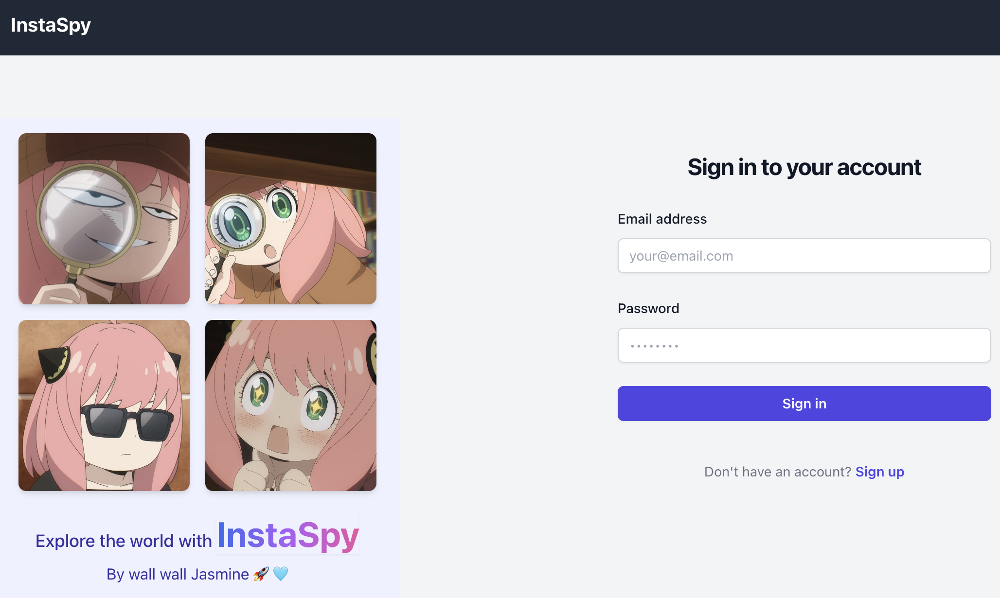
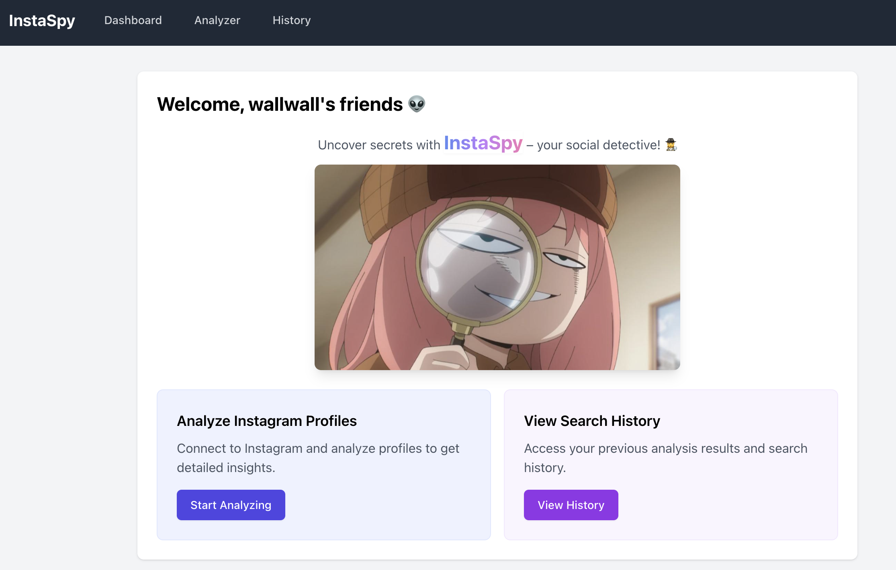
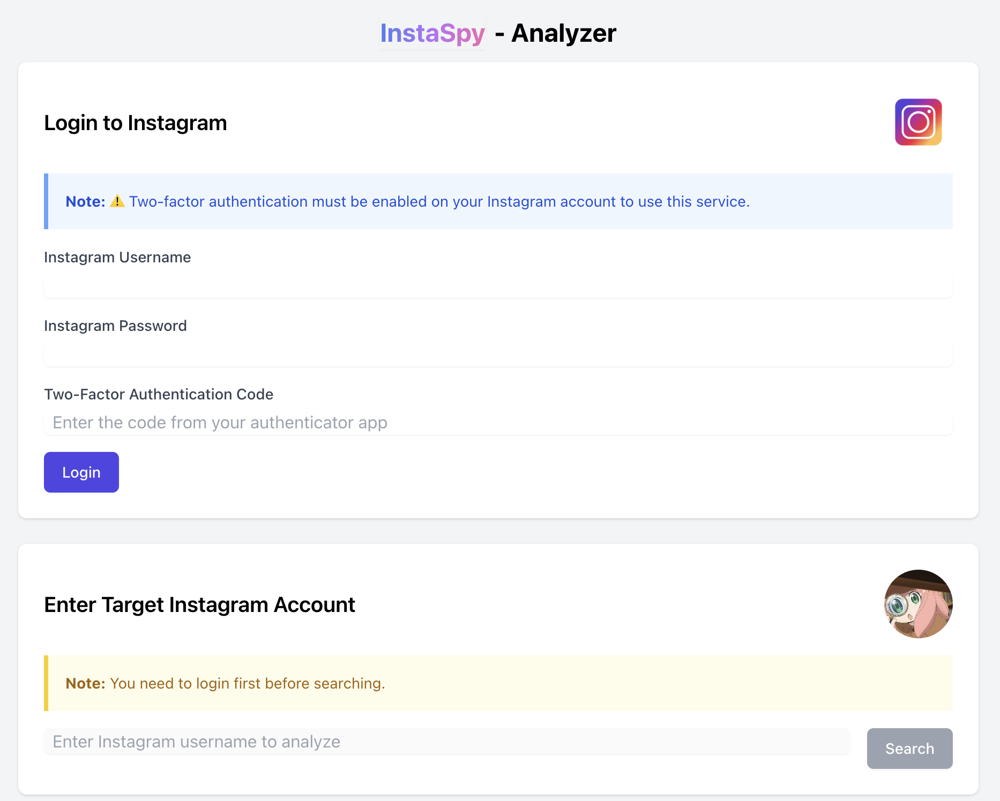
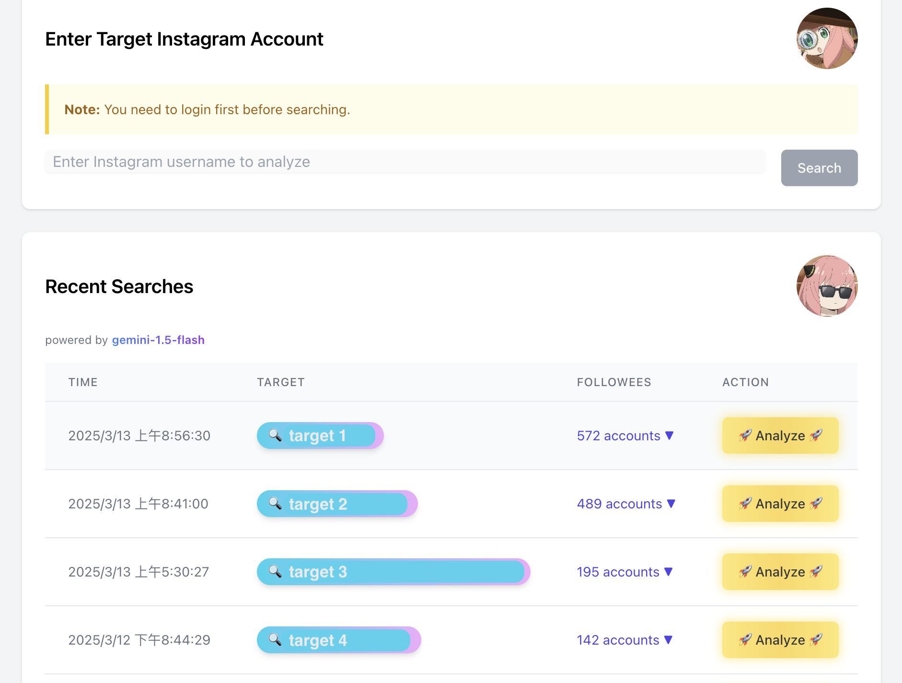
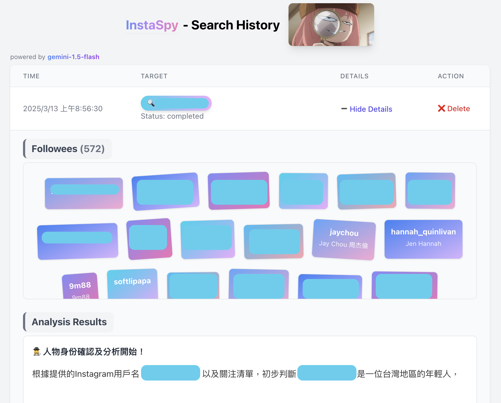

# 🔎 InstaSpy 
A tool for analyzing Instagram users' followees using LLM technology.    
(Currently supporting Gemini-2.0-Flash model integration.)

## ✨ Features
- Website login/logout
- **IG Service**
  - Instagram login/logout
  - Fetch target user's followee
- 🚀 **LLM Service**
  - Analyze target user's followee, give you interesting insights
- **History**
  - View all search history
  - View a detailed search result
  - Delete a specific search

## 🌷 Demo

<div align="center">
  
  <p>Login interface</p>
  
  <p>Dashboard</p>
  
  <p>1. Instagram login with authentication code <br> 2. Target user's followee data retrieval</p>
  
  <p>Recent search display with <strong>Analyze</strong> option</p>
  
  <p>Detailed Search history including <strong>Followee list</strong> & <strong>Analysis report</strong></p>
</div>

## 🌲 Project Structure
```
/
├── backend/            # Node.js backend
├── frontend/           # React frontend
├── demo/               # Demo screenshots and images
├── .gitignore
└── README.md
```

## 🍽️ Environment Requirements
- Node.js: v22.14.0 or higher
- npm: 10.9.2 or higher
- React: v9.0.0 (frontend)
- Express.js: v4.21.2 (backend)
- Python: 3.11 or higher
  - dependencies: instagrapi, pillow
- MongoDB: v4.4

## 💻 Contributors
- [@jasminechennnnn](https://github.com/jasminechennnnn)
